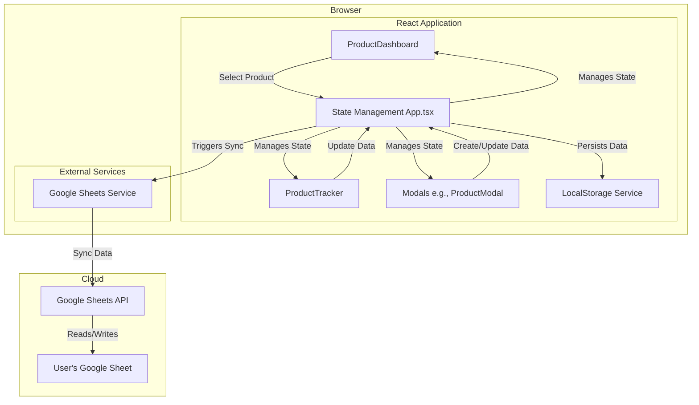
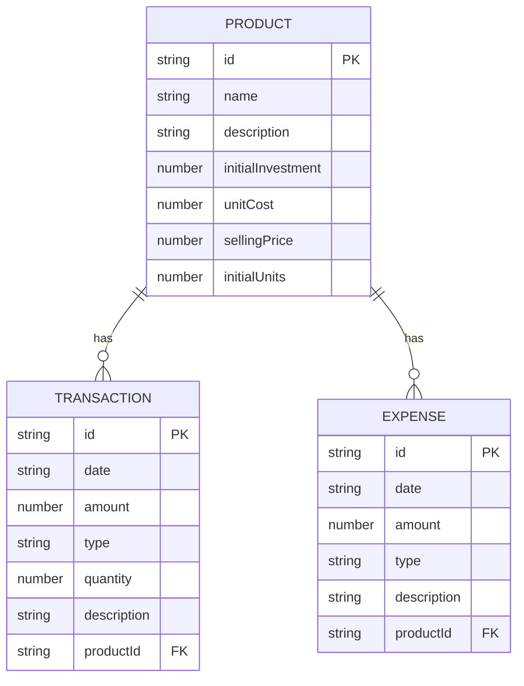
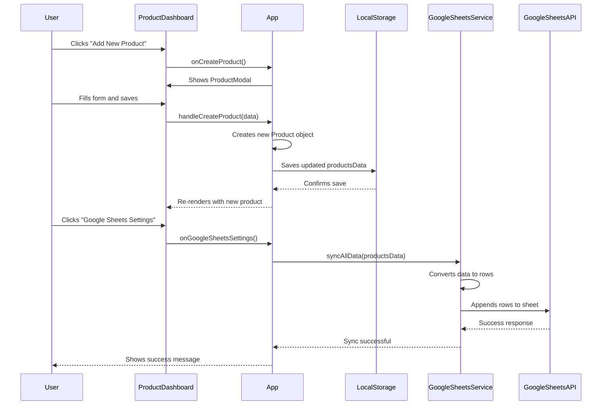

# Architectural Document: Multi-Business Finance Tracker

## 1. High-Level Application Overview and Purpose

The Multi-Business Finance Tracker is a comprehensive financial management tool designed for small business owners and entrepreneurs who manage multiple product lines or ventures. It provides a centralized dashboard to track revenue, expenses, inventory, and profitability for each product, offering both a high-level overview and detailed analytics. The application aims to simplify financial tracking by providing real-time insights and seamless integration with Google Sheets for data backup and further analysis.

Key features include:
- **Multi-Product Dashboard**: A unified view of all product lines with key performance indicators.
- **Detailed Product Trackers**: In-depth financial analysis for each individual product.
- **Google Sheets Integration**: Automatic synchronization of financial data to a user-configured Google Sheet.
- **Real-time Analytics**: Calculation of metrics such as total revenue, net profit, return on investment (ROI), and inventory levels.
- **Local Data Persistence**: User data is saved in the browser's local storage for a seamless experience.

The application is designed to be intuitive and user-friendly, empowering users to make informed financial decisions without the need for complex accounting software.

## 2. Main Components

The application follows a client-side architecture with three primary components: the **Frontend**, the **Backend (Data Storage)**, and an **External Integration** with Google Sheets.

### 2.1. Frontend

The frontend is a single-page application (SPA) built with **React** and **TypeScript**. It is responsible for rendering the user interface, managing application state, and handling all user interactions.

- **`App.tsx`**: The main application component that manages the overall view (dashboard vs. product tracker) and orchestrates data flow between components.
- **`ProductDashboard.tsx`**: Displays a summary of all products, including key stats like revenue and profit. It allows users to add, edit, or delete products.
- **`ProductTracker.tsx`**: Provides a detailed view for a single product, including financial charts, transaction logs, and performance metrics.
- **`components/`**: Contains reusable UI components, such as modals for adding products or settings for Google Sheets.
- **`services/`**: Includes modules responsible for business logic and external communication.

### 2.2. Backend (Data Storage)

The application uses a combination of local and cloud-based storage, functioning as a lightweight backend.

- **Local Storage**: The primary data store is the browser's **local storage**. All product data, transactions, and expenses are serialized and saved locally, ensuring data persistence between sessions. This approach simplifies the architecture by avoiding the need for a dedicated server and database.
- **Google Sheets**: Serves as a secondary, cloud-based backup and data analysis tool. The application can read from and write to a user's Google Sheet, providing a durable and shareable data store.

### 2.3. External Integrations

- **Google Sheets API**: The application integrates with the Google Sheets API to synchronize financial data. This allows users to maintain a permanent record of their finances, collaborate with others, or perform custom analysis in a familiar spreadsheet environment. The integration is handled by `services/googleSheetsService.ts` and `services/simpleGoogleSheetsService.ts`.

## 3. Key Data Models

The application's data is structured around three core models: `Product`, `Transaction`, and `Expense`.

- **`Product`**: Represents a distinct business or product line.
  - `id`: `string` (Unique identifier)
  - `name`: `string` (Product name)
  - `description`: `string` (Brief description)
  - `initialInvestment`: `number` (Initial capital invested)
  - `unitCost`: `number` (Cost to produce one unit)
  - `sellingPrice`: `number` (Price per unit)
  - `initialUnits`: `number` (Starting inventory)
  - `color`: `string` (UI color code)
  - `icon`: `string` (UI icon identifier)

- **`Transaction`**: Represents a sale record.
  - `id`: `string` (Unique identifier)
  - `date`: `string` (ISO date string)
  - `amount`: `number` (Total sale amount)
  - `type`: `'sale'` (Fixed type)
  - `quantity`: `number` (Number of units sold)
  - `description`: `string` (Notes about the sale)

- **`Expense`**: Represents a business expense.
  - `id`: `string` (Unique identifier)
  - `date`: `string` (ISO date string)
  - `amount`: `number` (Expense amount)
  - `type`: `'expense'` (Fixed type)
  - `description`: `string` (Description of the expense)

## 4. Core Workflows

### 4.1. Creating a New Product

1.  **User Action**: The user clicks the "Add New Product" button on the `ProductDashboard`.
2.  **Frontend**: A `ProductModal` is displayed, allowing the user to input the product details (name, cost, price, etc.).
3.  **State Management**: Upon saving, the `App` component creates a new `Product` object and adds it to the application's state.
4.  **Data Persistence**: The updated state, including the new product, is serialized to JSON and saved in the browser's local storage.
5.  **UI Update**: The `ProductDashboard` re-renders to display the new product card.

### 4.2. Recording a Transaction (Sale/Expense)

1.  **User Action**: From the `ProductTracker` view, the user clicks "Record a Sale" or "Add an Expense."
2.  **Frontend**: A modal (`SaleModal` or `ExpenseModal`) appears for data entry.
3.  **State Management**: Upon submission, a new `Transaction` or `Expense` object is created and associated with the current product. The application state is updated.
4.  **Data Persistence**: The new transaction is saved to local storage along with the rest of the product data.
5.  **UI Update**: The `ProductTracker` view updates to reflect the new entry in the transaction log and recalculates all financial stats.

### 4.3. Synchronizing Data with Google Sheets

1.  **User Action**: The user navigates to the Google Sheets settings and initiates a sync.
2.  **Frontend**: The `App` component gathers all product, transaction, and expense data from its state.
3.  **Data Transformation**: The data is converted into a flat, tabular format suitable for a spreadsheet.
4.  **API Call**: The `googleSheetsService` sends the data to the Google Sheets API, which appends the records to the configured spreadsheet.
5.  **Feedback**: The UI provides feedback to the user on whether the sync was successful.

## 5. Technology Stack

-   **Frontend**:
    -   **Framework**: [React](https://reactjs.org/) 19
    -   **Language**: [TypeScript](https://www.typescriptlang.org/)
    -   **Build Tool**: [Vite](https://vitejs.dev/)
    -   **Styling**: [Tailwind CSS](https://tailwindcss.com/) (utility-first CSS framework)
    -   **Charting**: [Recharts](https://recharts.org/) (for data visualization)
    -   **Icons**: [Lucide React](https://lucide.dev/)
-   **Backend (Data Storage)**:
    -   **Primary**: Browser Local Storage API
    -   **Secondary/Backup**: [Google Sheets](https://www.google.com/sheets/about/)
-   **External Integrations**:
    -   **API**: [Google Sheets API v4](https://developers.google.com/sheets/api)

## 6. Architectural Diagrams (Mermaid.js)

### 6.1. Component Diagram

This diagram illustrates the high-level components of the application and their interactions.

### 6.2. Data Model Diagram

This diagram shows the relationships between the core data entities.

### 6.3. Sequence Diagram: Adding a New Product and Syncing

This diagram illustrates the sequence of events when a user adds a new product and syncs the data.

